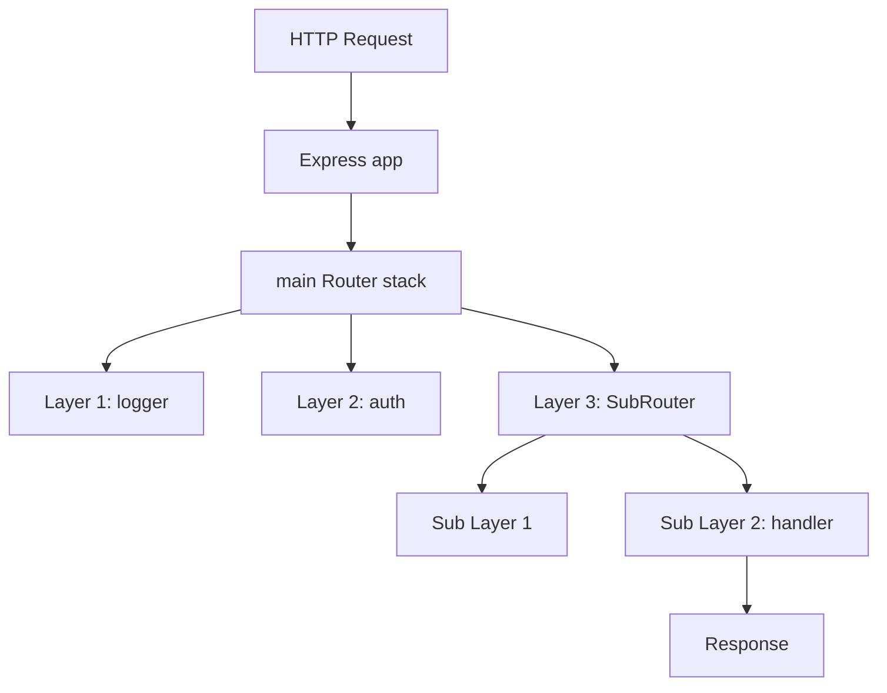
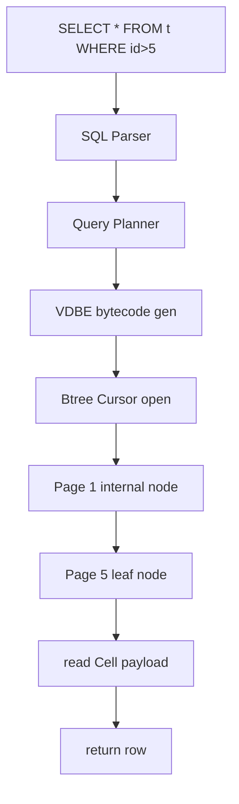

# Cross-Domain Full Walkthrough Examples

> This is the companion file to `walkthrough-template.md`. The template itself uses AI agents / OpenClaw as the main example; this file uses **condensed full walkthroughs** in two other domains so the AI can see "what the same nine-section template looks like in a different domain."
>
> Each example is condensed (5-15 lines per section), not full teaching material. When generating an actual walkthrough, expand to the word counts specified in walkthrough-template.md.

---

## Table of Contents

- **Example 1: web framework domain / Express** — middleware chain walkthrough
  - §0 General view — Pipe-and-Filter architecture
  - §1 What problem does this module solve — middleware registration + chain dispatch
  - §2 Core concepts — middleware / Layer / Router / next / error bubbling
  - §3 Overall architecture — main Router + sub Router nesting
  - §4 Minimal Comparison Method — 30-line minimal vs Express actual code
  - §5 Code navigation — from `app.handle` to `layer.handle_request`
  - §6 Test questions / §7 Implications / §8 Further reading
- **Example 2: database internals / SQLite** — B-tree cursor walkthrough
  - §0 General view — Bayer & McCreight 1971 B-tree theory
  - §1 What problem does this module solve — data organized by pages + cursor state machine
  - §2 Core concepts — Page / Cell / Cursor / BtNode / WAL
  - §3 Overall architecture — full mermaid diagram from SQL to cursor for a SELECT
  - §4 Minimal Comparison Method — 15-line minimal cursor vs SQLite actual code
  - §5 Code navigation — from OP_OpenRead to sqlite3BtreeNext
  - §6 Test questions / §7 Implications / §8 Further reading
- **How to use these two examples** — guidance to the AI + argument that the 9-section template is stable across domains

---

## Example 1: web framework domain / Express

**Hypothetical scenario**: student wants to learn web backend frameworks; target repo is [expressjs/express](https://github.com/expressjs/express). In stage-0 the student worked through some "Express middleware from scratch in a few hundred lines" beginner repo (chosen via Phase 2C search + user evaluation).

Walkthrough topic: **the full path of one HTTP request from `app.use` registration to the final `res.send` response.**

---

### §0. General view

> Modern web frameworks almost all use the **middleware chain** abstraction — a request comes in, passes through a list of functions in registration order, each of which can modify req/res and hand control off via `next()`.

**Academic / industry core insight**: this pattern came from Doug Crockford's Pipe-and-Filter architecture, was first used in Node.js by Connect (2010), and Express inherited it to become the de facto standard. The core insight: HTTP request processing is essentially "pipeline processing" — authentication, logging, rate limiting, business handling — each step independent but order-sensitive.

**Repack to target repo**: Express models this pipeline as a **Layer linked list + Router tree** — `app.use(fn)` wraps `fn` into a Layer and appends it to the list; when a request arrives, it walks from the head of the list.

**Minimal skeleton preview**:

```javascript
// 12-line minimal implementation, immediately readable
function createApp() {
  const stack = [];  // middleware chain
  function app(req, res) {
    let i = 0;
    function next() {
      const layer = stack[i++];
      if (!layer) return res.end('404');
      layer(req, res, next);  // pass next to the middleware
    }
    next();
  }
  app.use = fn => stack.push(fn);
  return app;
}
```

**Further reading**: see `resources/articles/express-architecture.md` and `stage-1-foundations/02-web-framework-patterns.md`.

---

### §1. What problem does this module solve

#### §1.1 Reverse argument

Without a middleware chain, every request handler would have to write its own auth / logging / error handling / rate limiting — code explosion, and one change touches dozens of files.

#### §1.2 Comparison of 3 common solutions

| Solution | Characteristics | Representative |
|------|------|------|
| Servlet Filter | Order declared in config; subclass-based | Java Servlet API |
| Decorator Chain | Decorator pattern, chained syntax | Flask before_request / after_request |
| Functional middleware chain | Function signature `(req, res, next) => void` | **Express / Koa** |

#### §1.3 One-sentence positioning

**Express's middleware chain implements the "HTTP request processing pipeline" with the simplest function signature `(req, res, next)`, plus a register-and-traverse pattern.**

---

### §2. Core concepts

#### §2.1 Key glossary

| Term | English | One-sentence definition |
|------|------|-----------|
| middleware | middleware | A function with signature `(req, res, next) => void` that modifies req/res or decides whether to pass to the next |
| Layer | Layer | Express's internal wrapper around each middleware, including path-match info |
| Router | Router | A container of middlewares; supports nesting (mini-app) |
| next | next | The callback Express injects; calling it hands control to the next middleware |
| error middleware | error middleware | A signature with 4 args `(err, req, res, next)`; handles upstream errors |

#### §2.2 General-concept → Express implementation

| General concept | Implementation in Express |
|---------|----------------|
| middleware registration | `app.use(path, fn)` → creates a Layer, appends to router stack |
| request traversal | `Layer.handle_request(req, res, next)` recursive call |
| path matching | `Layer.match(path)` using path-to-regexp |
| error bubbling | `next(err)` skips normal middleware and finds the next error middleware |

---

### §3. Overall architecture

#### §3.1 Component diagram



#### §3.2 Key design decisions

ADR (Architecture Decision Record — a short doc recording why a design decision was made) -1: use **function signature** rather than **class inheritance** for middleware

- **Context**: early Java Servlet used the Filter interface (class implements Filter); after Node.js came out, the community looked for something lighter
- **Decision**: Express picked the plain function signature `(req, res, next) => void`
- **Consequence**:
  - ✅ Extremely flat learning curve — if you can write a function, you can write middleware
  - ✅ Easy to test — middleware is just a function; mock req/res
  - ✅ Free composition — middleware can be an anonymous arrow function or a module export
  - ❌ Error handling needs convention (4-arg error middleware), less guaranteed than a type system

---

### §4. Minimal Comparison Method in action

#### §4.0 High-level code map

```
HTTP request enters
    │
    ▼
node_modules/express/lib/application.js:140  ← app(req, res) entry
    │ (calls router.handle)
    ▼
lib/router/index.js:138                       ← Router.handle function
    │
    └── Focus on these lines here:
        - line 138: handle()              ← receives request, starts traversal
        - line 199: next()                 ← dispatches to next layer
        - line 280: layer.handle_request   ← actually calls the middleware function
```

#### §4.1 Step 1: authoritative minimal implementation (reference + summary)

**Minimal implementation source** (**vetted by Phase 2C web search + user evaluation**; assume the student picked some from-scratch beginner repo in stage-0):
  `{stage-0-fundamentals/cloned/express-from-scratch}/middleware-chain.js:1-30`
**Why this is authoritative**: 30 lines implement "app.use + next chain + path matching" — three core concepts, no external dependencies. The student has run and modified it in stage-0; strongest cognitive anchor.

**5-10 line pseudocode summary**:

```javascript
// Adapted from stage-0 beginner repo. Strips path matching / error handling, keeps next() chain skeleton
function createApp() {
  const stack = [];
  function app(req, res) {
    let i = 0;
    (function next() {
      const layer = stack[i++];
      if (!layer) return res.end('404');
      layer(req, res, next);  // ← key: pass next to current middleware
    })();
  }
  app.use = fn => stack.push(fn);
  return app;
}
```

#### §4.2 Step 2: Express's matching code

```javascript
// repos/express/lib/router/index.js:138-199
// Corresponds to minimal version's: next() chain dispatch entry
proto.handle = function handle(req, res, out) {
  var self = this;
  var idx = 0;
  // ... (omitted 50 lines: path/method matching, params, mount)
  next();

  function next(err) {
    var layer = self.stack[idx++];
    // ... (omitted 40 lines: error handling, route matching, layer.match)
    layer.handle_request(req, res, next);  // ← matches minimal version's layer(req, res, next)
  }
}
```

#### §4.3 Step 3: three-column comparison table

| Minimal version | Express code location | Explanation |
|---------|---------------|------|
| `const stack = []` | `Router.prototype.stack` in `router/index.js:48` | Array → property on the Router instance; supports nesting |
| `stack.push(fn)` | `Router.use()` in `router/index.js:431` | Plain push → wrapped into a `Layer(path, fn)` object |
| `layer(req, res, next)` | `layer.handle_request(req, res, next)` in `router/layer.js:86` | Direct call → wrapped in try/catch + Promise support |
| `if (!layer) return res.end('404')` | `done(layerError)` in `router/index.js:67` | Simple 404 → full finalhandler chain (error page / static file fallback / etc) |

#### §4.4 Step 4: industrial enhancement diff

```
Minimal version (30 lines)             Express enhanced (~1500 lines of router code)
─────────────────                      ──────────────────────────────────────
const stack = []          →    + Layer object wrapping (path / method / params)
                                + sub-Router nesting support
                                + path prefix mounting (app.use('/api', subRouter))

layer(req, res, next)     →    + try/catch (sync exception capture)
                                + Promise support (async middleware)
                                + Error middleware routing (4-arg function)
                                + Layer.match path regex (path-to-regexp)

next()                    →    + next('route') skips remaining layers in current route
                                + next('router') exits current sub-router
                                + Error bubbling (next(err) finds the next error middleware)
─────────────────                      ──────────────────────────────────────
Core principle: the extras aren't "more concepts" — they're "doing the same thing more robustly"
```

---

### §5. Code navigation

#### Round 1 (30 min): trace one GET request from entry to handler

1. Open `repos/express/lib/application.js`, search for `app.handle` (around line 167)
2. Focus on lines 167-184: this is the HTTP entry into Express
3. Find line 175: `router.handle(req, res, done)` — hands the request to the main Router

#### Round 2 (30 min): understand the next() chain

1. Open `repos/express/lib/router/index.js`, search for `proto.handle` (around line 138)
2. Focus on lines 199-280: the implementation of the next function
3. Find line 280: `layer.handle_request(req, res, next)` — the industrial version of minimal version's `layer(req, res, next)`

---

### §6. Test questions

- **Concept check**: `exercises/concept-checks.md#04-express-middleware-chain`
- **Code finding**: `exercises/code-finding.md#04-express-middleware-chain`
- **Transfer**: `exercises/transfer.md#04-express-middleware-chain`

---

### §7. Implications for your project

#### §7.1 Designs you can reuse

| Express's design | How to use in your project |
|--------------|-----------------|
| Functional middleware signature | If you're building an API gateway / RPC service, use `(req, res, next) => void` instead of inheritance hierarchies |
| next() chain dispatch | Any "pipeline processing" scenario (logging / rate limiting / auth) can use this |

#### §7.2 Things that need to change

| Express's design | Why it doesn't fit you | How to change |
|--------------|--------------|-------|
| Synchronous next() | If you're building an async worker pool, next should return a Promise | Change to async middleware; next returns a Promise |

---

### §8. Further reading

- Tier 1: [Express official router source with comments](https://github.com/expressjs/express/blob/master/lib/router/index.js)
- Tier 2: [Koa's reflections on Express](https://github.com/koajs/koa/blob/master/docs/koa-vs-express.md)

---

## Example 2: database internals / SQLite (B-tree cursor)

**Hypothetical scenario**: student wants to learn database internals; target repo is [sqlite/sqlite](https://github.com/sqlite/sqlite) (or a mirror). In stage-0 the student worked through `cstack/db_tutorial` (a 13-part from-scratch SQLite-style DB).

Walkthrough topic: **how a SELECT query traverses data pages through a B-tree cursor**.

---

### §0. General view

> The core problem of database internals is "how do you efficiently query rows when you can't fit all the data in memory?" **B-tree** is the agreed answer — organize data into a tree of "pages" (around 4KB-16KB each, matching one disk IO). The **cursor** is the state machine that walks this tree.

**Academic / industry core insight**: B-trees were proposed in 1971 by Bayer and McCreight (not 1979 as Comer's Bell-Labs survey suggested), key insight: **a node's fanout = how many keys one IO can read** — bigger fanout, shallower tree, fewer IOs per query. SQLite uses a 4096-byte default page + average 200 keys/page; 1 billion rows need only a 4-level tree.

**Repack to target repo**: SQLite's `btree.c` (~11k lines) lands this theory on disk files + WAL (Write-Ahead Logging — log before write, ensures crash recovery). The cursor is the user-facing API — things like `sqlite3BtreeFirst()` / `sqlite3BtreeNext()`.

**Minimal skeleton preview**:

```c
// 15-line minimal implementation, immediately readable
typedef struct {
  Page *page;       // current page
  int cell_index;   // cell offset within page
} Cursor;

Row* cursor_next(Cursor *c) {
  if (c->cell_index >= c->page->num_cells) {
    c->page = c->page->next_leaf;  // jump to next leaf page
    c->cell_index = 0;
  }
  return read_cell(c->page, c->cell_index++);
}
```

**Further reading**: see `resources/papers/btree-bayer-1971.pdf` and `stage-1-foundations/02-storage-engine-patterns.md`.

---

### §1. What problem does this module solve

#### §1.1 Reverse argument

If a database used a linked list instead of B-tree, querying 100M rows would mean 100M disk IOs. If you didn't use a cursor and just "read everything," querying 10 rows from a 10GB table would need 10GB of memory.

#### §1.2 Comparison of 3 common solutions

| Solution | Characteristics | Representative |
|------|------|------|
| Hash Index | O(1) equality lookup; can't do range queries | Redis dict |
| LSM-tree | Fast writes, slow reads; needs compaction | RocksDB / Cassandra |
| **B-tree** | Balanced read/write, range-query friendly | **SQLite / MySQL InnoDB / PostgreSQL** |

#### §1.3 One-sentence positioning

**SQLite's B-tree cursor wraps "iterating disk data pages by key order" into a core iterator-state-machine abstraction.**

---

### §2. Core concepts

#### §2.1 Key glossary

| Term | English | One-sentence definition |
|------|------|-----------|
| Page | Page | Smallest unit of disk IO (default 4096 bytes in SQLite) |
| Cell | Cell | One row's storage unit within a page (key + payload) |
| Cursor | Cursor | State object pointing at a page + a cell inside it |
| BtNode | BtNode | Either an internal node (child page pointers) or a leaf (cells) |
| WAL | Write-Ahead Logging | Write the log first, recoverable on crash |

#### §2.2 General-concept → SQLite implementation

| General concept | Implementation in SQLite |
|---------|----------------|
| Open a cursor | `sqlite3BtreeCursor()` in `btree.c` |
| Move to first cell | `sqlite3BtreeFirst()` |
| Move to next cell | `sqlite3BtreeNext()` |
| Read cell payload | `sqlite3BtreePayload()` |

---

### §3. Overall architecture

#### §3.1 Component diagram



#### §3.2 Key design decisions

ADR (Architecture Decision Record — a short doc recording why a design decision was made) -1: cursor is an **explicit state machine** rather than an **iterator protocol**

- **Context**: C has no Python-style generator / iterator protocol
- **Decision**: SQLite designs the cursor as an explicit struct; all operations go through `sqlite3BtreeXxx(cursor, ...)` functions
- **Consequence**:
  - ✅ Controllable state — the cursor state can be serialized (for checkpoint)
  - ✅ Predictable memory — one cursor is around 200 bytes
  - ❌ The caller has to manually manage the cursor lifecycle (open / close symmetry)

---

### §4. Minimal Comparison Method in action

#### §4.0 High-level code map

```
SELECT executes
    │
    ▼
repos/sqlite/src/vdbe.c:5234       ← OP_OpenRead bytecode handling
    │ (calls sqlite3BtreeCursor)
    ▼
repos/sqlite/src/btree.c:6789      ← cursor initialization
    │
    └── Focus on these lines:
        - line 6789: sqlite3BtreeCursor   ← creates the cursor struct
        - line 7234: sqlite3BtreeNext     ← moves to next cell (the core)
        - line 7891: moveToLeftmost       ← descent when entering child pages
```

#### §4.1 Step 1: authoritative minimal implementation (reference + summary)

**Minimal implementation source** (**vetted by Phase 2C web search + user evaluation**; assume the student picked `cstack/db_tutorial` Part 8-10 B-tree implementation in stage-0):
  `{stage-0-fundamentals/cloned/db_tutorial}/db.c:780-820` (Part 10 leaf node implementation)
**Why this is authoritative**: a 13-part tutorial that walks step by step from hash table to B-tree; lines 780-820 are the core of cursor traversal in a leaf node, ~40 lines of C. The student ran all 13 parts in stage-0 and knows every line.

**5-10 line pseudocode summary**:

```c
// Adapted from db_tutorial Part 10, stripped of disk IO / split handling, keeps cursor traversal skeleton
typedef struct {
  Pager *pager;
  uint32_t page_num;
  uint32_t cell_num;
} Cursor;

Row* cursor_next(Cursor *c) {
  Page *page = get_page(c->pager, c->page_num);
  c->cell_num++;
  if (c->cell_num >= leaf_node_num_cells(page)) {
    c->page_num = *leaf_node_next_leaf(page);  // ← linked-list-style page hop
    c->cell_num = 0;
  }
  return leaf_node_value(page, c->cell_num - 1);
}
```

#### §4.2 Step 2: SQLite's matching code

```c
// repos/sqlite/src/btree.c:7234
// Corresponds to minimal version's: cursor_next() body
int sqlite3BtreeNext(BtCursor *pCur, int flags) {
  MemPage *pPage;
  pCur->ix++;
  pPage = pCur->pPage;
  if (pCur->ix >= pPage->nCell) {
    // ... (omitted 80 lines: parent page traversal, balance check, lock)
    rc = moveToNext(pCur);  // ← matches minimal version's c->page_num = next_leaf
  }
  return SQLITE_OK;
}
```

#### §4.3 Step 3: three-column comparison table

| Minimal version | SQLite code location | Explanation |
|---------|---------------|------|
| `Cursor` struct | `BtCursor` in `btreeInt.h:548` | Simple struct → 50+ fields (saved state / overflow / shared cache) |
| `cursor_next()` plain ++ | `sqlite3BtreeNext()` in `btree.c:7234` | Plain increment → balance check + parent backtrack + lock state |
| `get_page(pager, num)` direct read | `getAndInitPage()` in `btree.c:1289` | Direct IO → page cache lookup + WAL check + checksum |
| `next_leaf` linked-list hop | `moveToNext()` + parent backtrack in `btree.c:6201` | One-way list → real B-tree tree-walk backtracking |

#### §4.4 Step 4: industrial enhancement diff

```
Minimal version (40 lines)              SQLite enhanced (~11000 lines of btree.c)
─────────────────                      ──────────────────────────────────────
Cursor struct (3 fields)  →    + saved cursor state (transaction support)
                                + overflow page handling (large cells)
                                + shared cache state
                                + write cursor vs read cursor distinction

cursor_next() ++          →    + node merge / split check after balance
                                + parent page backtracking (not just list hop)
                                + lock state machine (SHARED / RESERVED / EXCLUSIVE)

get_page() direct IO      →    + page cache (LRU eviction)
                                + WAL check (latest writes are in WAL, not main file)
                                + checksum verification
                                + mmap optimization path

next_leaf one-way list    →    + real B-tree tree structure
                                + internal nodes vs leaf nodes
                                + page number shifts during auto-vacuum
─────────────────                      ──────────────────────────────────────
Core principle: the extras aren't "more concepts" — they're "doing the same thing more robustly, more safely, more recoverably"
```

---

### §5. Code navigation

#### Round 1 (30 min): trace one SELECT's cursor lifecycle

1. Open `repos/sqlite/src/vdbe.c`, search for `OP_OpenRead` (around line 5234)
2. Focus on lines 5234-5290: how VDBE handles the OP_OpenRead opcode to create a cursor
3. Find line 5267: `rc = sqlite3BtreeCursor(...)` — the actual cursor creation entry

#### Round 2 (30 min): understand BtreeNext's intra-page advance

1. Open `repos/sqlite/src/btree.c`, search for `sqlite3BtreeNext` (around line 7234)
2. Focus on lines 7234-7320: all branches of a single next call
3. Find line 7280: `if (pCur->ix >= pPage->nCell)` — the industrial version of minimal version's "linked-list page hop"

---

### §6. Test questions

- **Concept check**: `exercises/concept-checks.md#05-sqlite-btree-cursor`
- **Code finding**: `exercises/code-finding.md#05-sqlite-btree-cursor`
- **Transfer**: `exercises/transfer.md#05-sqlite-btree-cursor`

---

### §7. Implications for your project

#### §7.1 Designs you can reuse

| SQLite's design | How to use in your project |
|--------------|-----------------|
| Explicit cursor state machine | For streaming data processing, use an explicit cursor instead of an implicit generator — serializable + controllable state |
| Page-based IO | When building your own storage engine, page-based (4KB-16KB) reads/writes are more efficient than per-row |

#### §7.2 Things that need to change

| SQLite's design | Why it doesn't fit you | How to change |
|--------------|--------------|-------|
| Single-process reader lock | If you're building distributed storage, a single-machine lock isn't enough | Switch to distributed lease / Raft commit index |

---

### §8. Further reading

- Tier 1: [Bayer & McCreight original paper (1972)](https://github.com/iam-abbas/papers-i-love)
- Tier 2: [cstack/db_tutorial full 13 parts](https://cstack.github.io/db_tutorial/)
- Tier 3: [SQLite internal docs](https://www.sqlite.org/arch.html)

---

## How to use these two examples

### Guidance for the AI

When generating an actual walkthrough (following walkthrough-template.md's nine-section template):

- If the target repo is in the web framework domain → match Example 1's tone, term density, skeleton-element presentation
- If the target repo is in the database internals domain → match Example 2
- For other domains (OS / compiler / game engine / distributed) → apply the same nine-section template; look up skeleton elements in `multi-domain-examples.md` §1

### Key observation: the nine-section template is stable across domains

Comparing Example 1 (web framework) and Example 2 (database), the nine-section structure (§0-§8) is identical. What changes:
- §0 cites different academic / engineering history (Pipe-and-Filter 1970s vs B-tree 1971)
- §2.1's glossary has different specific terms (middleware / Layer vs Cell / Cursor)
- §4 cites different code file:lines
- §4.4's industrial enhancements are different specifics (async support vs page cache / WAL)

This shows **the five steps of the Minimal Comparison Method are cross-domain general** — any domain that has a "core control flow + industrial implementation" comparison can use this template.

### Future expansion

Each time we teach a new domain in practice (OS / compiler / game engine), we can backfill the condensed walkthrough from that session as a new example here. This file accumulates depth as the skill is used.
