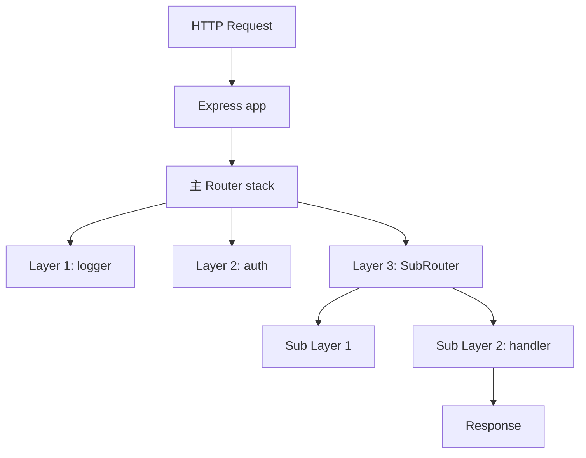
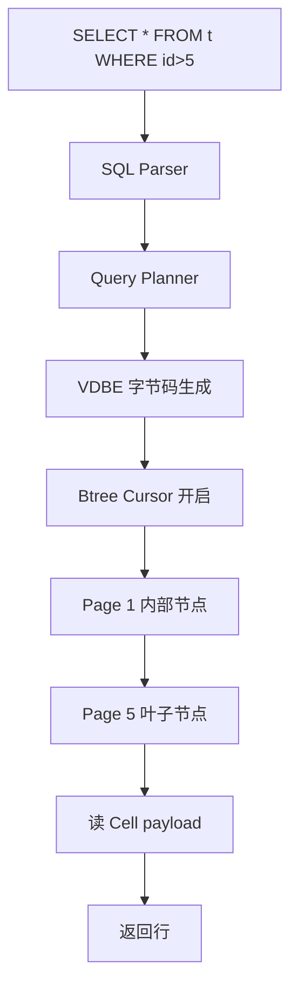

# 跨领域完整 walkthrough 示例

> 这是 `walkthrough-template.md` 的配套文件。模板本身用 AI Agent / OpenClaw 做主示例，本文件用另外两个领域的**缩略版完整 walkthrough**让 AI 看清楚"同一个九章模板在不同领域是什么样"。
>
> 每个示例都是缩略版（每章 5-15 行说明），不是完整教学材料。真实生成时按 walkthrough-template.md 的字数要求展开。

---

## 示例一：Web 框架领域 / Express

**假设场景**：学生想学 Web 后端框架，目标 repo 选了 [expressjs/express](https://github.com/expressjs/express)。学生在 stage-0 跑通了某个"几百行 from scratch 实现 Express middleware"的 beginner repo（具体由 Phase 2C 搜索 + 用户评估决定）。

walkthrough 主题：**一条 HTTP 请求从 `app.use` 注册到最终 `res.send` 响应的完整路径**。

---

### §0. 通用视角

> 现代 Web 框架几乎都用 **middleware 链**这个抽象——一个请求进来，按注册顺序经过一串函数，每个函数可以加工 req/res 对象，然后通过 `next()` 把控制权交给下一个。

**学术/工程界的核心洞察**：这个模式来自 Doug Crockford 的 Pipe-and-Filter 架构思想，被 Connect (2010) 首次用在 Node.js 上，Express 继承下来成为事实标准。核心洞察：HTTP 请求的处理本质是"流水线加工"——身份验证、日志、限流、业务处理——每一步独立但顺序敏感。

**Repack 到目标 repo**：Express 把这个流水线建模成一个 **Layer 链表 + Router 树**——`app.use(fn)` 把 fn 包装成一个 Layer 加到链表里，请求来了从头遍历这个链表。

**最简骨架预览**：

```javascript
// 一眼看懂的 12 行最简实现
function createApp() {
  const stack = [];  // middleware 链
  function app(req, res) {
    let i = 0;
    function next() {
      const layer = stack[i++];
      if (!layer) return res.end('404');
      layer(req, res, next);  // 把 next 传给 middleware
    }
    next();
  }
  app.use = fn => stack.push(fn);
  return app;
}
```

**延伸阅读**：参见 `resources/articles/express-architecture.md` 和 `stage-1-foundations/02-web-framework-patterns.md`。

---

### §1. 这个模块解决什么问题

#### §1.1 反向论证

如果没有 middleware 链，每个请求处理函数都要自己写身份验证、日志、错误处理、限流——重复代码爆炸，且改一个地方要改几十个文件。

#### §1.2 业界三种通用解法对比

| 方案 | 特点 | 代表 |
|------|------|------|
| Servlet Filter | 配置文件声明顺序，类继承实现 | Java Servlet API |
| Decorator Chain | 装饰器模式，链式语法 | Flask before_request / after_request |
| 函数式 Middleware 链 | 函数签名 `(req, res, next) => void` | **Express / Koa** |

#### §1.3 一句话定位

**Express 的 middleware 链是把"HTTP 请求加工流水线"用最简单的函数签名 `(req, res, next)` 实现的注册-遍历模式。**

---

### §2. 核心概念

#### §2.1 关键术语

| 术语 | 英文 | 一句话定义 |
|------|------|-----------|
| 中间件 | middleware | 签名 `(req, res, next) => void` 的函数，加工请求/响应或决定是否传给下一个 |
| 层 | Layer | Express 内部把每个 middleware 包成的对象，含路径匹配信息 |
| 路由器 | Router | 一组 middleware 的容器，支持嵌套（mini-app） |
| 调度函数 | next | 由 Express 注入的回调，调用它把控制权交给下一个 middleware |
| 错误中间件 | error middleware | 签名带 4 个参数 `(err, req, res, next)`，专门处理上游抛错 |

#### §2.2 通用概念 → Express 实现的对照表

| 通用概念 | Express 里的实现 |
|---------|----------------|
| middleware 注册 | `app.use(path, fn)` → 创建 Layer 加入 router stack |
| 请求遍历链 | `Layer.handle_request(req, res, next)` 递归调用 |
| 路径匹配 | `Layer.match(path)` 用 path-to-regexp |
| 错误冒泡 | `next(err)` 跳过普通 middleware，找到下一个 error middleware |

---

### §3. 整体架构

#### §3.1 组件关系图



#### §3.2 关键设计决策

ADR（Architecture Decision Record，记录某个设计决策为什么这样定的简短文档）-1：用**函数签名**而不是**类继承**做 middleware

- **Context（背景）**：早期 Java Servlet 用 Filter 接口（class implements Filter），Node.js 出来后社区在思考更轻量的写法
- **Decision（决策）**：Express 选用 `(req, res, next) => void` 这种 plain function 签名
- **Consequence（后果）**：
  - ✅ 学习曲线极平——会写函数就会写 middleware
  - ✅ 测试简单——middleware 就是普通函数，mock req/res 即可
  - ✅ 组合自由——middleware 可以是匿名箭头、可以是模块导出
  - ❌ 错误处理需要约定（4 参数的 error middleware），不如类型系统保证可靠

---

### §4. 最简对照法实战

#### §4.0 高层级代码框架

```
HTTP 请求进入
    │
    ▼
node_modules/express/lib/application.js:140  ← app(req, res) 入口
    │ (调用 router.handle)
    ▼
lib/router/index.js:138                       ← Router.handle 函数
    │
    └── 关注这里的几行：
        - line 138: handle()              ← 接收请求，启动遍历
        - line 199: next()                 ← 调度下一个 layer
        - line 280: layer.handle_request   ← 实际调用 middleware 函数
```

#### §4.1 Step 1：权威最简实现（引用源 + 摘要双区块）

**最简实现来源**（**由 Phase 2C 网络搜索 + 用户评估确认**，这里假设学生在 stage-0 选了某个 from-scratch beginner repo）：
  `{stage-0-fundamentals/cloned/express-from-scratch}/middleware-chain.js:1-30`
**为什么是权威最简实现**：30 行就实现了"app.use + next 链 + 路径匹配"三个核心，无任何外部依赖。学生在 stage-0 跑过、改过，认知锚点最强。

**5-10 行伪代码摘要**：

```javascript
// 改编自 stage-0 beginner repo，剥离 path matching / error handling，保留 next() 链骨架
function createApp() {
  const stack = [];
  function app(req, res) {
    let i = 0;
    (function next() {
      const layer = stack[i++];
      if (!layer) return res.end('404');
      layer(req, res, next);  // ← 关键：把 next 传给当前 middleware
    })();
  }
  app.use = fn => stack.push(fn);
  return app;
}
```

#### §4.2 Step 2：Express 对应代码

```javascript
// repos/express/lib/router/index.js:138-199
// 对应权威最简版的：next() 链调度入口
proto.handle = function handle(req, res, out) {
  var self = this;
  var idx = 0;
  // ... (omitted 50 lines: path/method matching, params, mount)
  next();

  function next(err) {
    var layer = self.stack[idx++];
    // ... (omitted 40 lines: error handling, route matching, layer.match)
    layer.handle_request(req, res, next);  // ← 对应最简版 layer(req, res, next)
  }
}
```

#### §4.3 Step 3：三列对照表

| 最简版本 | Express 代码位置 | 说明 |
|---------|---------------|------|
| `const stack = []` | `Router.prototype.stack` in `router/index.js:48` | 数组 → Router 实例上的属性，支持嵌套 |
| `stack.push(fn)` | `Router.use()` in `router/index.js:431` | 直接 push → 包装成 `Layer(path, fn)` 对象 |
| `layer(req, res, next)` | `layer.handle_request(req, res, next)` in `router/layer.js:86` | 直接调用 → 包装 try/catch + Promise 支持 |
| `if (!layer) return res.end('404')` | `done(layerError)` in `router/index.js:67` | 简单 404 → 完整 finalhandler 链（错误页 / 静态文件 fallback / etc） |

#### §4.4 Step 4：工业级增强差异图

```
最简版本 (30 行)                      Express 增强 (~1500 行 router 部分)
─────────────────                      ──────────────────────────────────────
const stack = []          →    + Layer 对象包装（path / method / params）
                                + Sub-Router 嵌套支持
                                + 路径前缀挂载（app.use('/api', subRouter)）

layer(req, res, next)     →    + try/catch（同步异常捕获）
                                + Promise 支持（async middleware）
                                + Error middleware 路由（4 参数函数）
                                + Layer.match 路径正则匹配（path-to-regexp）

next()                    →    + next('route') 跳过当前 route 剩余 layer
                                + next('router') 跳出当前 sub-router
                                + 错误冒泡（next(err) 找下一个 error middleware）
─────────────────                      ──────────────────────────────────────
核心原则：多出来的不是"更多概念"，是"把同样的事做得更健壮"
```

---

### §5. 代码导航

#### 第 1 轮（30 分钟）：追踪一条 GET 请求从入口到 handler

1. 打开 `repos/express/lib/application.js`，搜索 `app.handle`（约第 167 行附近）
2. 关注 line 167-184：这是 HTTP 请求进入 Express 的入口
3. 找到 line 175：`router.handle(req, res, done)` —— 把请求转给主 Router

#### 第 2 轮（30 分钟）：理解 next() 链

1. 打开 `repos/express/lib/router/index.js`，搜索 `proto.handle`（约第 138 行）
2. 关注 line 199-280：next 函数的实现
3. 找到 line 280：`layer.handle_request(req, res, next)` —— 这是最简版 `layer(req, res, next)` 在 Express 里的真身

---

### §6. 检验问题

- **概念检查**：`exercises/concept-checks.md#04-express-middleware-chain`
- **代码定位**：`exercises/code-finding.md#04-express-middleware-chain`
- **迁移应用**：`exercises/transfer.md#04-express-middleware-chain`

---

### §7. 对你目标项目的启发

#### §7.1 可以直接复用的设计

| Express 的设计 | 在你项目里怎么用 |
|--------------|-----------------|
| 函数式 middleware 签名 | 你做 API gateway / RPC 服务时，用 `(req, res, next) => void` 替代继承层级 |
| next() 链调度 | 任何"加工流水线"场景（日志 / 限流 / 鉴权）都可以套用 |

#### §7.2 需要改造的地方

| Express 的设计 | 为什么不适合你 | 怎么改 |
|--------------|--------------|-------|
| 同步 next() | 你做异步 worker pool 时，next 应该返回 Promise | 改为 async middleware，next 改返 Promise |

---

### §8. 延伸阅读

- Tier 1：[Express 官方 router 源码注释](https://github.com/expressjs/express/blob/master/lib/router/index.js)
- Tier 2：[Koa 对 Express 的反思和改造](https://github.com/koajs/koa/blob/master/docs/koa-vs-express.md)

---

## 示例二：数据库内核领域 / SQLite（B-tree cursor）

**假设场景**：学生想学数据库内核，目标 repo 选了 [sqlite/sqlite](https://github.com/sqlite/sqlite)（或镜像）。学生在 stage-0 跑通了 `cstack/db_tutorial`（一个 13 part 的 from-scratch SQLite 风格 DB）。

walkthrough 主题：**一条 SELECT 查询如何通过 B-tree cursor 遍历数据页**。

---

### §0. 通用视角

> 数据库内核的核心问题是"如何在不能一次把数据装进内存时，高效查到行"。**B-tree** 是公认的答案——它把数据组织成"页（page）"为单位的树，每页大约 4KB-16KB，对应一次磁盘 IO。**cursor** 是遍历这棵树的状态机。

**学术/工程界的核心洞察**：B-tree 是 1971 年 Bayer 和 McCreight 提出的（不是 Bell 实验室的 Comer 综述里 1979 才系统总结），核心洞察：**节点的扇出（fanout）= 一次 IO 能读多少 key**——扇出越大，树越浅，查询 IO 次数越少。SQLite 用 4096 字节默认页大小 + 平均 200 key/page，10 亿行只需要 4 层树深。

**Repack 到目标 repo**：SQLite 的 `btree.c`（约 1.1 万行）就是把这个理论落地到磁盘文件 + WAL（Write-Ahead Logging，预写日志，保证崩溃恢复）的工程实现。cursor 是用户接触的对外 API——`sqlite3BtreeFirst()` / `sqlite3BtreeNext()` 这种。

**最简骨架预览**：

```c
// 一眼看懂的 15 行最简实现
typedef struct {
  Page *page;       // 当前所在页
  int cell_index;   // 当前页内的 cell 偏移
} Cursor;

Row* cursor_next(Cursor *c) {
  if (c->cell_index >= c->page->num_cells) {
    c->page = c->page->next_leaf;  // 跳到下一个叶子页
    c->cell_index = 0;
  }
  return read_cell(c->page, c->cell_index++);
}
```

**延伸阅读**：参见 `resources/papers/btree-bayer-1971.pdf` 和 `stage-1-foundations/02-storage-engine-patterns.md`。

---

### §1. 这个模块解决什么问题

#### §1.1 反向论证

如果数据库不用 B-tree 用链表，查 1 亿行要扫 1 亿次磁盘 IO；如果不用 cursor 用"一次读全部"，10GB 表查 10 行也要 10GB 内存。

#### §1.2 业界三种通用解法对比

| 方案 | 特点 | 代表 |
|------|------|------|
| Hash Index | 等值查询 O(1)，无法范围查询 | Redis dict |
| LSM-tree | 写入快读慢，需 compaction | RocksDB / Cassandra |
| **B-tree** | 读写均衡，范围查询友好 | **SQLite / MySQL InnoDB / PostgreSQL** |

#### §1.3 一句话定位

**SQLite 的 B-tree cursor 是把"按 key 顺序遍历磁盘数据页"封装成迭代器状态机的核心抽象。**

---

### §2. 核心概念

#### §2.1 关键术语

| 术语 | 英文 | 一句话定义 |
|------|------|-----------|
| 页 | Page | 磁盘 IO 的最小单位（SQLite 默认 4096 字节） |
| 单元 | Cell | 页内一行数据的存储单元（含 key + payload） |
| 游标 | Cursor | 指向某个页 + 页内某个 cell 的状态对象 |
| B-tree 节点 | BtNode | 内部节点（存子页指针）或叶子节点（存 cell） |
| WAL | Write-Ahead Logging | 写之前先写日志，崩溃可恢复 |

#### §2.2 通用概念 → SQLite 实现的对照表

| 通用概念 | SQLite 里的实现 |
|---------|----------------|
| 打开 cursor | `sqlite3BtreeCursor()` in `btree.c` |
| 移到第一个 cell | `sqlite3BtreeFirst()` |
| 移到下一个 cell | `sqlite3BtreeNext()` |
| 读 cell payload | `sqlite3BtreePayload()` |

---

### §3. 整体架构

#### §3.1 组件关系图



#### §3.2 关键设计决策

ADR（Architecture Decision Record，记录设计决策的简短文档）-1：cursor 是**显式状态机**而不是**迭代器协议**

- **Context（背景）**：C 语言没有 Python 那种 generator / iterator protocol
- **Decision（决策）**：SQLite 把 cursor 设计成显式 struct，所有操作通过 `sqlite3BtreeXxx(cursor, ...)` 函数
- **Consequence（后果）**：
  - ✅ 状态可控——cursor 状态可序列化（用于 checkpoint）
  - ✅ 内存可预测——一个 cursor 大约 200 字节，可控
  - ❌ 调用者需要手动管理 cursor 生命周期（open / close 对称）

---

### §4. 最简对照法实战

#### §4.0 高层级代码框架

```
SELECT 执行
    │
    ▼
repos/sqlite/src/vdbe.c:5234       ← OP_OpenRead 字节码处理
    │ (调用 sqlite3BtreeCursor)
    ▼
repos/sqlite/src/btree.c:6789      ← cursor 初始化
    │
    └── 关注这里的几行：
        - line 6789: sqlite3BtreeCursor   ← 创建 cursor struct
        - line 7234: sqlite3BtreeNext     ← 移动到下一个 cell（核心）
        - line 7891: moveToLeftmost       ← 进入子页时的下钻
```

#### §4.1 Step 1：权威最简实现（引用源 + 摘要双区块）

**最简实现来源**（**由 Phase 2C 网络搜索 + 用户评估确认**，这里假设学生在 stage-0 选了 `cstack/db_tutorial` Part 8-10 的 B-tree 实现）：
  `{stage-0-fundamentals/cloned/db_tutorial}/db.c:780-820`（Part 10 leaf node 实现）
**为什么是权威最简实现**：13 part 教程一步步从 hash table 演进到 B-tree，line 780-820 是 cursor 在叶子节点遍历的核心，~40 行 C 代码。学生在 stage-0 完整跑过这 13 part，对每一行都熟。

**5-10 行伪代码摘要**：

```c
// 改编自 db_tutorial Part 10，剥离磁盘 IO/分裂处理，保留 cursor 遍历骨架
typedef struct {
  Pager *pager;
  uint32_t page_num;
  uint32_t cell_num;
} Cursor;

Row* cursor_next(Cursor *c) {
  Page *page = get_page(c->pager, c->page_num);
  c->cell_num++;
  if (c->cell_num >= leaf_node_num_cells(page)) {
    c->page_num = *leaf_node_next_leaf(page);  // ← 链表式跳页
    c->cell_num = 0;
  }
  return leaf_node_value(page, c->cell_num - 1);
}
```

#### §4.2 Step 2：SQLite 对应代码

```c
// repos/sqlite/src/btree.c:7234
// 对应权威最简版的：cursor_next() 主体
int sqlite3BtreeNext(BtCursor *pCur, int flags) {
  MemPage *pPage;
  pCur->ix++;
  pPage = pCur->pPage;
  if (pCur->ix >= pPage->nCell) {
    // ... (omitted 80 lines: parent page traversal, balance check, lock)
    rc = moveToNext(pCur);  // ← 对应最简版 c->page_num = next_leaf
  }
  return SQLITE_OK;
}
```

#### §4.3 Step 3：三列对照表

| 最简版本 | SQLite 代码位置 | 说明 |
|---------|---------------|------|
| `Cursor` struct | `BtCursor` in `btreeInt.h:548` | 简单 struct → 50+ 字段（含 saved state / overflow / shared cache） |
| `cursor_next()` 直接++ | `sqlite3BtreeNext()` in `btree.c:7234` | 直接自增 → balance 检查 + 父页回溯 + 锁状态 |
| `get_page(pager, num)` 直接读 | `getAndInitPage()` in `btree.c:1289` | 直接 IO → page cache 查询 + WAL 检查 + checksum |
| `next_leaf 链表跳` | `moveToNext()` + 父页回溯 in `btree.c:6201` | 单向链表 → B-tree 真正的树形回溯 |

#### §4.4 Step 4：工业级增强差异图

```
最简版本 (40 行)                      SQLite 增强 (~11000 行 btree.c)
─────────────────                      ──────────────────────────────────────
Cursor struct (3 字段)    →    + saved cursor state（事务支持）
                                + overflow page 处理（大 cell）
                                + shared cache 状态
                                + write cursor vs read cursor 区分

cursor_next() 自增        →    + balance 后的节点合并 / 分裂检查
                                + 父页回溯（不只是链表跳）
                                + 锁状态机（SHARED / RESERVED / EXCLUSIVE）

get_page() 直接 IO        →    + page cache（LRU 淘汰）
                                + WAL 检查（最新写在 WAL 不在主文件）
                                + checksum 验证
                                + mmap 优化路径

next_leaf 单向链表        →    + 真正的 B-tree 树形结构
                                + 内部节点 vs 叶子节点
                                + auto-vacuum 时的页号变化
─────────────────                      ──────────────────────────────────────
核心原则：多出来的不是"更多概念"，是"把同样的事做得更健壮、更安全、更可恢复"
```

---

### §5. 代码导航

#### 第 1 轮（30 分钟）：追踪一条 SELECT 的 cursor 生命周期

1. 打开 `repos/sqlite/src/vdbe.c`，搜索 `OP_OpenRead`（约第 5234 行）
2. 关注 line 5234-5290：VDBE 解析到 OP_OpenRead 操作码时如何创建 cursor
3. 找到 line 5267：`rc = sqlite3BtreeCursor(...)` —— cursor 创建的实际入口

#### 第 2 轮（30 分钟）：理解 BtreeNext 的页内推进

1. 打开 `repos/sqlite/src/btree.c`，搜索 `sqlite3BtreeNext`（约第 7234 行）
2. 关注 line 7234-7320：单次 next 的全部分支
3. 找到 line 7280：`if (pCur->ix >= pPage->nCell)` —— 这是最简版"链表跳页"在工业实现里的真身

---

### §6. 检验问题

- **概念检查**：`exercises/concept-checks.md#05-sqlite-btree-cursor`
- **代码定位**：`exercises/code-finding.md#05-sqlite-btree-cursor`
- **迁移应用**：`exercises/transfer.md#05-sqlite-btree-cursor`

---

### §7. 对你目标项目的启发

#### §7.1 可以直接复用的设计

| SQLite 的设计 | 在你项目里怎么用 |
|--------------|-----------------|
| Cursor 显式状态机 | 你做流式数据处理时，用显式 cursor 替代隐式 generator——可序列化 + 状态可控 |
| Page-based IO | 你做自己的存储引擎时，按页（4KB-16KB）读写比按行更高效 |

#### §7.2 需要改造的地方

| SQLite 的设计 | 为什么不适合你 | 怎么改 |
|--------------|--------------|-------|
| 单进程 reader 锁 | 你做分布式存储时单机锁不够 | 改为分布式 lease / Raft commit index |

---

### §8. 延伸阅读

- Tier 1：[Bayer & McCreight 原论文 (1972)](https://github.com/iam-abbas/papers-i-love)
- Tier 2：[cstack/db_tutorial 完整 13 part](https://cstack.github.io/db_tutorial/)
- Tier 3：[SQLite 内部文档](https://www.sqlite.org/arch.html)

---

## 怎么用这两个示例

### 给 AI 看的指引

AI 在生成实际 walkthrough 时（按 walkthrough-template.md 的九章模板）：

- 如果目标 repo 是 Web 框架领域 → 参考示例一的语气、术语密度、骨架元素呈现方式
- 如果目标 repo 是数据库内核领域 → 参考示例二
- 如果是其他领域（OS / 编译器 / 游戏引擎 / 分布式）→ 套用同九章模板，骨架元素查 `multi-domain-examples.md` §1

### 关键观察：九章模板跨领域是稳定的

对比示例一（Web 框架）和示例二（数据库），九章结构（§0-§8）完全一样。变化的只是：
- §0 引用的学术/工程历史（Pipe-and-Filter 1970s vs B-tree 1971）
- §2.1 术语表里的具体词（middleware / Layer vs Cell / Cursor）
- §4 引用的具体代码 file:line
- §4.4 工业级增强的具体增强项（异步支持 vs page cache / WAL）

这证明了**最简对照法五步**是跨领域通用的——任何领域只要有"核心控制流 + 工业级实现"的对比，就能套这个模板。

### 未来扩展

每次实战教学一个新领域（OS / 编译器 / 游戏引擎），可以把那次的 walkthrough 缩略版回填到本文件作为新示例。本文件会随着 skill 使用经验积累越来越厚。
